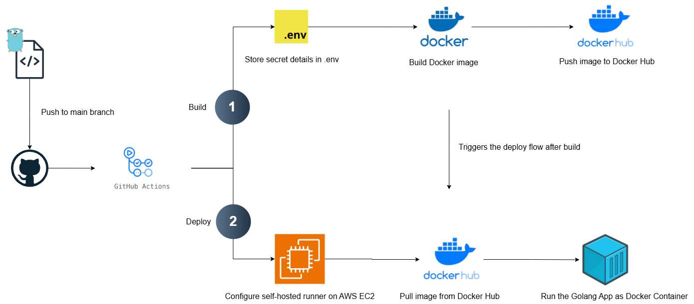

# Project ai-powered-study-planner-backend

The AI-powered Study Planner is a web application designed to help students and lifelong learners manage their study schedules effectively. It leverages AI to enhance user experience by providing personalized feedback and insights, optimizing learning efficiency, and ensuring sustainable time management.

## Getting Started

These instructions will get you a copy of the project up and running on your local machine for development and testing purposes. See deployment for notes on how to deploy the project on a live system.

## The sourcecode structure


## Prepare the .env

```
PORT=

DB_HOST=
DB_USERNAME=
DB_PASSWORD=
DB_DATABASE=

FIREBASE_ADMIN=
FIREBASE_WEB_API_KEY=

OPENAI_API_KEY=

REDIS_URI=
REDIS_PASSWORD=
```

## Import the seed data from database folder (Optional)

Read the README.md in `database` folder

## MakeFile

Run build make command with tests

```bash
make all
```

Build the application

```bash
make build
```

Run the application

```bash
make run
```

Live reload the application:

```bash
make watch
```

Clean up binary from the last build:

```bash
make clean
```

## Build image from Dockerfile

```bash
docker build -t <image_name>:<tag> <path_to_dockerfile>
```

## The CI/CD flow with Github Actions


